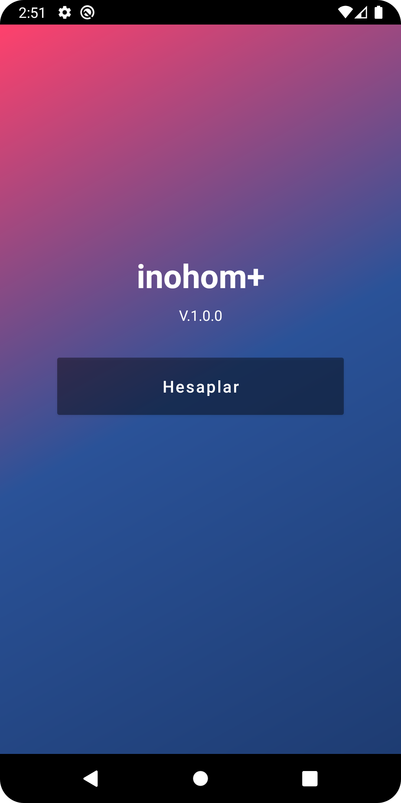
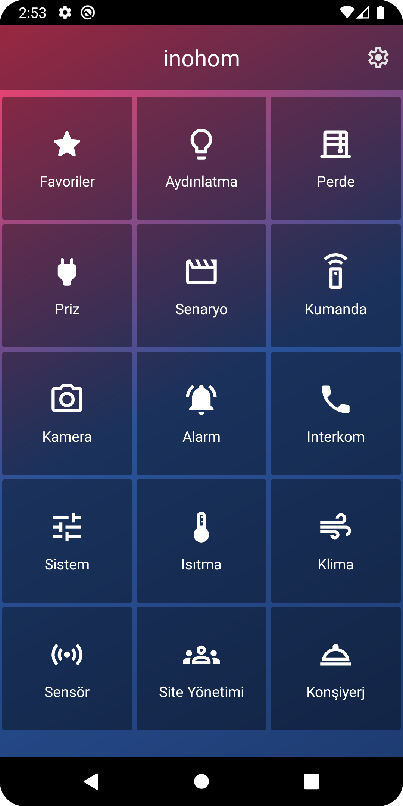

# INOHOM Android Task

This is a technical assignment project developed as part of the Android Developer recruitment process for **INOHOM**. It demonstrates real-time control of smart home devices using WebSocket communication, following a clean MVVM architecture.

---

## 📱 Features

- 🔐 User authentication over WebSocket with JSON-based messaging
- 🏠 Static dashboard screen with categorized device tiles (menu grid)
- 💡 Dynamic device listing on control screen using RecyclerView
- ⚡ Device state toggle support via ViewModel action binding
- 🔄 Real-time device state updates using WebSocket message listening
- 🖼️ Responsive UI with adaptive grid layout and gradient backgrounds
- 🧩 MVVM architecture using ViewModel, LiveData, and Fragment separation
- 📱 Material Design components for toolbar, tiles, and interaction
- ♻️ Lifecycle-aware components for WebSocket connection handling
- 💬 Localized UI strings via strings.xml
- 🎯 Drawable-based icon system with structured enum mapping

---

## 📸 Screenshots

| Login | Main Menu | Lighting Controls |
|-------|-----------|-------------------|
|  |  |  |

> Screenshots are from an emulated test session. Icons are placeholders.

---

## 🔧 Technologies Used

- Kotlin & Android SDK  
- WebSocket
- Gson for JSON serialization  
- AndroidX ViewModel & LiveData  
- Navigation Component  
- ConstraintLayout & RecyclerView  
- Custom gradients & vector drawables
